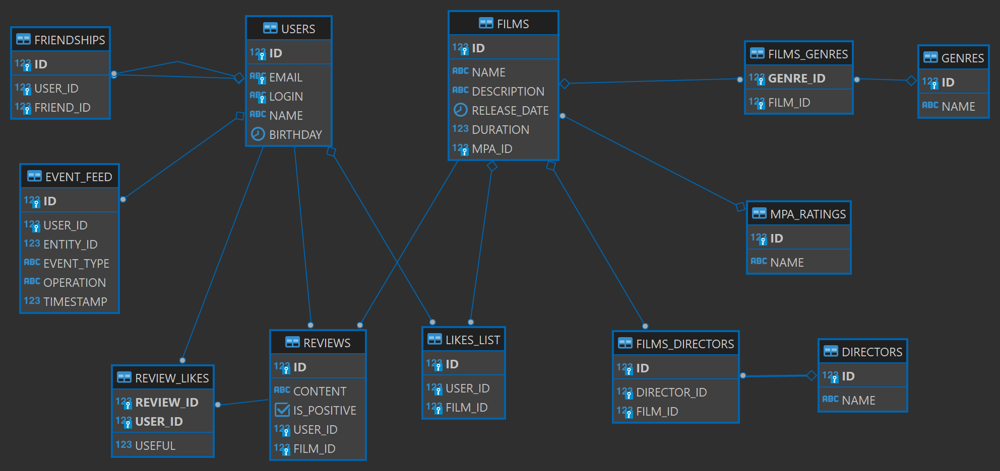

# Filmorate
___
## Описание
Filmorate - сервис предназначен для работы с фильмами и пользовательскими рейтингами, чтобы предоставлять персональные 
рекомендации любителям кино. С помощью этого сервиса пользователи могут оценивать фильмы, чтобы в дальнейшем сервис 
используя эти данные, мог предложить наиболее подходящий фильм для пользователя. Так же пользователи могут оставлять 
отзывы к фильмам, а другие пользователи лайкать или дизлайкать оставленные отзывы.
___
## Технологический стек
Java 11, Spring Boot, H2, JUnit.
___
## Способ взаимодествия с приложением.
С приложением можно взаимодействовать с протокола HTTP.  

Endpoints запросов:

Post /users – добавление пользователя в базу;  
Get /users/{userId} – получение пользователя по id;  
Get /users – получение всех пользователей из базы;  
Put /users/{userId} – обновление пользователя в базе по id;  
Delete /users/{userId} – удаление пользователя по id;
Get /users/{id}/feed - возвращает ленту событий пользователя;
Put /users/{userId}/friends/{friendId} – добавление пользователя с friendId в друзья;  
Get /users/{userId}/friends – получение списка друзей пользователя с userId;  
Get /users/{userId}/friends/common/{otherId} – получение списка общих друзей пользователей с userId и c otherId;  
GET /users/{userId}/recommendations - возвращает рекомендации по фильмам для просмотра.  

Post /films – добавление фильма в базу;  
Put /films – обновление фильма в базе;  
Get /films  – получение списка всех фильмов;  
Get /films/{filmId} – получение фильма по filmI;  
GET /films/popular?count={count} — возвращает список из первых count фильмов по количеству лайков.
Если значение параметра count не задано, верните первые 10;  
GET /fimls/search?query={query}&by=director,title — возвращает список фильмов по ключевому слову, отсортированных по 
популярности.

Get /directors - Список всех режиссёров;  
Get /directors/{id}- Получение режиссёра по id;  
Post /directors - Создание режиссёра;  
Put /directors - Изменение режиссёра;  
Delete /directors/{id} - Удаление режиссёра;  
Get /films/director/{directorId}?sortBy=[year,likes] -Возвращает список фильмов режиссера отсортированных по
количеству лайков или году выпуска.

Get /genres - получение всех жанров;  
Get /genres/{id} - получение жанра по id;

Get /mpa - получение всех возрастных ограничений;  
Get /mpa/{id} - получение возрастных ограничений по id;
___
## Хранение данных.
Данные хранятся в реляционной базе данных.  
БД: H2.

